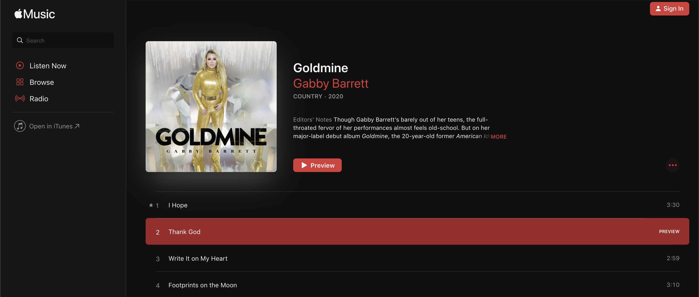

### Objective

In a fictional world, Aula Education has branched into the music business and we have launched a new web application. However it has some problems and is lacking features. This music app displays the top 100 songs based on the iTunes API and lets you search the results.

### Design Preview




### Existing codebase

* `frontend`: client side rendered React SPA.
* `backend`: Express server skeleton that will come in handy for one of your tasks. The server connects to an in-memory MongoDB store to simulate the persistence layer of the application.


# Installation and Environment Setup ⚙︎ 

**Clone the repository from [Github](https://github.com/pextech/aula-tunes.git).**

( You will need **Git** for this if you are running a Windows PC, Get it [HERE](https://git-scm.com/) )

```
git clone https://github.com/pextech/aula-tunes.git
```

**To Install all dependencies:** 🔧

```
npm install
```


**Now to start the app:**

```
npm run start
```


# Tools used

- React **javascript UI library**
- Material-UI: **css**
- Redux: **State manager**
- Docker: **Image/Container**
- NGINX: **WEb container**

# More Tools

- ES6 Transpiler: **[Babel](babeljs.io)**
<!-- - Deployment: **[Heroku](https://www.heroku.com)** and **[Netlify](https://www.netlify.com/)** -->

- Deployment : **Github-Pages**
<!-- - link to the app: **[link](https://pextech.github.io/Front-end-dutygenerator/)** -->

# Contribute

If you ever have an idea on how you might help improve the app, you are welcome to contribute your changes to the repository, Just follow the steps below:

Assumming you have the repo cloned on your PC,

- Pull the latest changes from the remote repo by running:

```
git pull origin develop
```

NB: You need to be on the develop branch when you do this

- Create & switch to the new branch where you will add your changes by running:

```
git checkout -b `yournewbranchname`
```

- After adding your changes, commit and push them to create a pull request against the develop branch. I will review and merge them if they are helpful.


# Author 

` Pextech 😎🇷🇼 `

